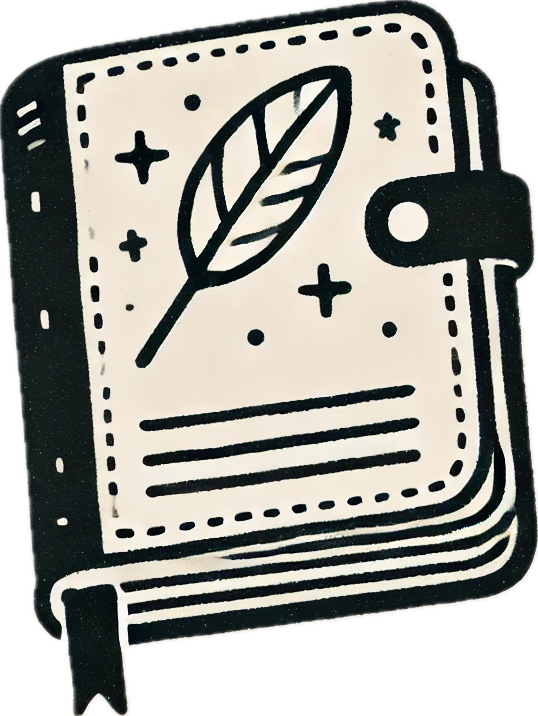

# Adso - Modern Note-Taking Application

Adso is a feature-rich, Notion-like note-taking application built with Next.js,
allowing you to create, organize, and share documents with a clean, intuitive
interface.



## Features

- **Rich Text Editor**: Create and edit documents with a powerful block-based
  editor
- **Document Organization**: Organize your notes with a sidebar navigation
  system
- **Real-time Collaboration**: Changes sync instantly with Convex backend
- **Light/Dark Mode**: Toggle between light and dark themes
- **Cover Images**: Add beautiful cover images to your documents
- **Icon Customization**: Personalize documents with custom icons
- **User Authentication**: Secure login with Clerk authentication
- **File Storage**: Upload and store images with EdgeStore
- **Responsive Design**: Works seamlessly across desktop and mobile devices

## Tech Stack

- **Frontend**: Next.js 15, React 19, TypeScript, Tailwind CSS
- **Backend**: Convex (for real-time database)
- **Authentication**: Clerk
- **Editor**: BlockNote
- **File Storage**: EdgeStore
- **Styling**: Tailwind CSS, Radix UI

## Developing

### Prerequisites

- Node.js 18.x or higher
- pnpm, npm, or yarn

### Installation

1. Clone the repository

   ```bash
   git clone https://github.com/mihaicristianfarcas/adso.git
   cd adso
   ```

2. Install dependencies

   ```bash
   pnpm install
   ```

3. Set up environment variables Create a `.env.local` file in the root directory
   with:

   ```
   # Clerk Authentication
   NEXT_PUBLIC_CLERK_PUBLISHABLE_KEY=
   CLERK_SECRET_KEY=

   # Convex
   NEXT_PUBLIC_CONVEX_URL=

   # EdgeStore
   EDGE_STORE_ACCESS_KEY=
   EDGE_STORE_SECRET_KEY=
   ```

4. Start the development server

   ```bash
   pnpm dev
   ```

5. Open [http://localhost:3000](http://localhost:3000) with your browser to see
   the app.

## Usage

- **Create a document**: Click the "+ New Document" button in the sidebar
- **Edit content**: Click on any document to open the editor
- **Add cover image**: Use the cover image tool in the editor toolbar
- **Customize icon**: Click the icon picker to change document icons
- **Publish your work**: Use the "Publish" button to share your work easily via
  the provided preview link
- **Chat with Adso**: Ask your AI assistant what you wish to know about the document
- **Toggle theme**: Use the theme toggle in the navbar

## License

This project is licensed under the MIT License.
